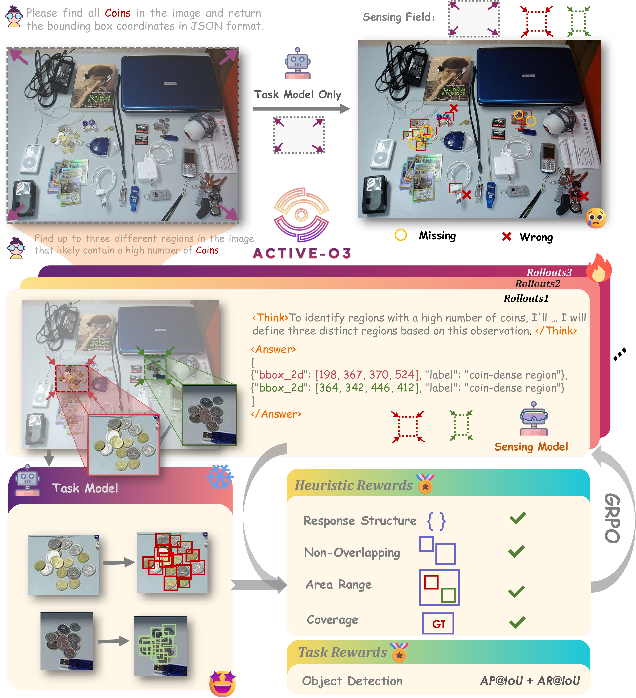

<div align="center">

# ACTIVE-O3: Empowering Multimodal Large Language Models with Active Perception via GRPO


<sup>1</sup>[Zhejiang University](https://www.zju.edu.cn/english/), &nbsp;
<sup>2</sup>[Ant Group](https://www.antgroup.com/en)

<!-- **CVPR2025** -->

[📄 **Paper**]()&nbsp; | &nbsp;[🌐 **Project Page**](https://aim-uofa.github.io/ACTIVE-o3)&nbsp; | &nbsp;[💾 **Model Weights**](https://www.modelscope.cn/models/zzzmmz/ACTIVE-o3)
</div>

## 🚀 Overview
<div align="center">

</div>

## 📖 Description

we propose ACTIVE-O3, a purely reinforcement learning-based training framework built on top of GRPO, designed to equip MLLMs with active perception capabilities. We further establish a comprehensive benchmark suite to evaluate ACTIVE-O3 across both general open-world tasks—such as small-object and dense object grounding—and domain-specific scenarios, including small object detection in remote sensing and autonomous driving, as well as fine-grained interactive segmentation. Experimental results demonstrate that ACTIVE-O3 significantly enhances active perception capabilities compared to Qwen-VL2.5-CoT. For example, Figure 1 shows an example of zero-shot reasoning on the V* benchmark, where ACTIVE- O3 successfully identifies the number on the traffic light by zooming in on the relevant region, while Qwen2.5-VL fails to do so. Moreover, across all downstream tasks, ACTIVE-O3 consistently improves performance under fixed computational budgets. We hope that our work here can provide a simple codebase and evaluation protocol to facilitate future research on active perception MLLM.


## 🚩 Plan
<!-- - [ ] Release the weights. -->
- [x] Release the weights.
- [x] Release the inference demo.
- [ ] Release the dataset.
- [ ] Release the training scripts.
- [ ] Release the evaluation scripts.
<!-- --- -->


## 🛠️ Getting Started

### 📐 Set up Environment

```bash

# build environment
conda create -n activeo3 python=3.10
conda activate activeo3

# install packages
pip install torch==2.5.1 torchvision==0.20.1
pip install flash-attn --no-build-isolation
pip install transformers==4.51.3
pip install qwen-omni-utils[decord]
```
###  🔍 demo

```bash
# run demo
python demo/activeo3_demo_vstar.py
```


## 🎫 License

For academic usage, this project is licensed under [the 2-clause BSD License](LICENSE). For commercial inquiries, please contact [Chunhua Shen](mailto:chhshen@gmail.com).

## 🖊️ Citation

If you find this work helpful for your research, please cite:

```BibTeX
@article{zhu2025segagent,
  title={SegAgent: Exploring Pixel Understanding Capabilities in MLLMs by Imitating Human Annotator Trajectories},
  author={Zhu, Muzhi and Tian, Yuzhuo and Chen, Hao and Zhou, Chunluan and Guo, Qingpei and Liu, Yang and Yang, Ming and Shen, Chunhua},
  journal={arXiv preprint arXiv:2503.08625},
  year={2025},
  url={https://arxiv.org/abs/2503.08625}
}